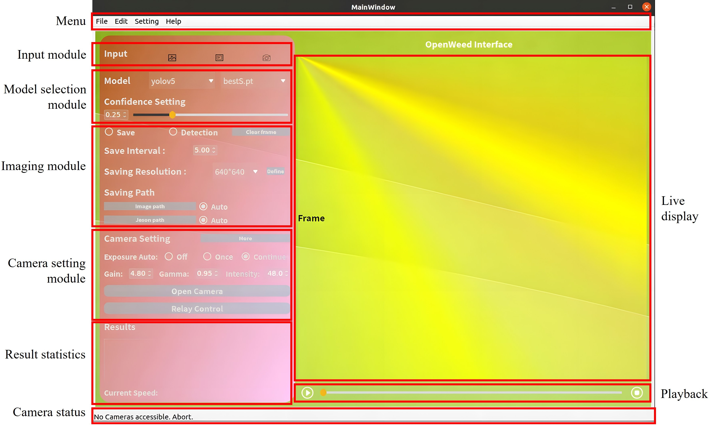

# OpenWeed-GUI
Welcome to the **OpenWeedGUI**! An Open-Source Graphical Tool for Weed Imaging and YOLO-based Weed Detection. We hope you can use it for many great applications and participate in the project. Don't be shy to ask questions, and provide feedback.
# Introduction
**OpenWeedGUI** is a graphical user interface (GUI) designed to bridge the gap between machine vision and artificial intelligence technologies for real-time weed detection in sustainable crop production. Built on the PyQt framework and leveraging open-source libraries, OpenWeedGUI simplifies the process of image acquisition and deployment of YOLO (You Only Look Once) models, making it a suitable tool for researchers, developers, and practitioners in the field of precision agriculture.

# Features
- Support 

